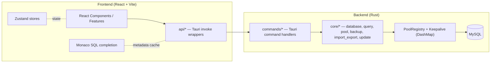

<div align="center">
  
</div>

<div align="center">

# Database Workbench

[简体中文(zh-CN)](README.md) / [English(en-US)](README.en.md)

</div>

<div align="center">

[](https://tauri.app)
[](https://react.dev)
[](https://www.typescriptlang.org)
[](https://www.rust-lang.org)
[](LICENSE)
[]()

</div>

A modern, lightweight database management desktop client built with **Tauri v2 + React + TypeScript**. Database Workbench provides an intuitive UI for connecting to databases, writing and running SQL, designing tables and views, managing users, and backing up / restoring data — all in a small, fast, native application.

---

## Table of Contents

- [Features](#features)
- [Tech Stack](#tech-stack)
- [Architecture](#architecture)
- [Project Structure](#project-structure)
- [Requirements](#requirements)
- [Getting Started](#getting-started)
- [Configuration](#configuration)
- [Development](#development)
- [Database Support & Roadmap](#database-support--roadmap)
- [Contributing](#contributing)
- [License](#license)
- [Links](#links)

---

## Features

### Connection & Query

- **Connection management** — MySQL connection profiles with SSL support (`disabled` / `preferred` / `required` / `verify-ca` / `verify-identity`), certificate configuration, and profile import / export.
- **SQL editor** — Powered by Monaco Editor with syntax highlighting, context-aware autocompletion (driven by live metadata caching), SQL formatting, and multi-result-set execution.
- **Script execution** — DELIMITER-aware SQL script splitting so `CREATE PROCEDURE / FUNCTION / TRIGGER` compound blocks execute correctly on a single physical connection.

### Object Design

- **Table designer** — Visual table design with fields, indexes, foreign keys, check constraints, and triggers; generates `CREATE` / `ALTER` SQL.
- **View designer** — Create and edit views, with editable data for updatable views.
- **Functions & stored procedures** — Create, edit, and execute functions / stored procedures.

### Data & Administration

- **Table data browser** — Browse, edit, insert, and delete rows with server-side pagination and CSV export.
- **User management** — Create users, manage server-level and database-level privileges, and generate the corresponding SQL.
- **Backup** — Native in-app dump (no external `mysqldump` required), with object-level selection (tables / views / routines) and advanced options (structure/data split, triggers, gzip, batched `INSERT`, transactions).
- **Restore** — Native restore from `.sql` and `.sql.gz`, with transactional execution and continue-on-error.
- **Scheduled backup** — Cron-based backup scheduling managed inside the app.
- **Import / Export** — Exchange data in CSV, JSON, JSONL, Excel (`.xlsx`), SQL, XML, HTML, and TXT formats.

### Productivity

- **Favorites** — Bookmark SQL queries, connection profiles, and database objects.
- **Notification center** — History of operations with unread indicators and one-click clear.
- **Execution log dock** — Real-time, backend-pushed SQL execution events with filtering and paging.
- **Auto-update** — Region-aware update source selection (GitHub / Gitee) with download progress.
- **Internationalization** — Simplified Chinese (`zh-CN`) and English (`en-US`).
- **Themes** — Light / dark theme switching.
- **Keyboard shortcuts** — Extensive shortcut support (see the in-app shortcuts dialog).

---

## Tech Stack

| Layer    | Technology |
| -------- | ---------- |
| Framework | [Tauri](https://tauri.app) v2 |
| Frontend  | React 18 + TypeScript 5, bundled with [Vite](https://vitejs.dev) 7 |
| UI kit    | [Blueprint.js](https://blueprintjs.com) v6 (`@blueprintjs/core`, `@blueprintjs/icons`) |
| Editor    | [Monaco Editor](https://microsoft.github.io/monaco-editor/) (`@monaco-editor/react`) |
| Styling   | Tailwind CSS 3 + `tailwind-merge` / `clsx` |
| State     | [Zustand](https://github.com/pmndrs/zustand) 5 |
| Tables    | [`@tanstack/react-table`](https://tanstack.com/table) v8 |
| i18n      | [i18next](https://www.i18next.com) + `react-i18next` + browser language detector |
| Icons     | [lucide-react](https://lucide.dev) |
| Backend   | Rust (edition 2021) |
| DB driver | [`sqlx`](https://github.com/launchbadge/sqlx) native MySQL driver (+ `mysql` crate) |
| Pooling   | `sqlx` native pools managed via a `DashMap`-backed connection registry with background keepalive |
| SQL parse | [`sqlparser`](https://github.com/apache/datafusion-sqlparser-rs) (statement splitting) |
| Office    | `calamine` (read Excel) / `rust_xlsxwriter` (write Excel), `csv`, `chrono`, `flate2` (gzip) |
| Runtime   | Tokio (multi-thread), `cron` (scheduling), `reqwest` + `rustls` (updater/geo) |
| Plugins   | Tauri plugins: `dialog`, `fs`, `opener`, `process`, `shell`, `updater` |

---

## Architecture

Database Workbench follows a standard Tauri v2 split: a **React/TypeScript frontend** communicates with a **Rust backend** exclusively through Tauri's IPC (`invoke`). The backend owns all database I/O and exposes typed commands; the frontend never talks to a database directly.



### Frontend

- `features/` — Self-contained feature modules (connection, query, metadata-tree, data-browser, designer, backup, user-management, options, favorites, updater, dialogs, welcome).
- `api/` — Thin wrappers around Tauri `invoke` calls; the only place that knows about the IPC boundary.
- `components/` — Shared layout, icons, and cross-cutting UI (notification center, execution log dock).
- `completion/` — Monaco SQL autocompletion provider fed by backend metadata.
- `stores/` — Zustand state. `i18n/` — locale resources. `lib/`, `hooks/`, `types/` — utilities, shared hooks, and types.

### Backend (Rust)

- `commands/` — One handler module per domain, registered in `lib.rs` (`invoke_handler`). ~80 commands covering pool, query, script, metadata, user, config, backup, import/export, favorites, sql utils, app, and updater.
- `core/` — Business logic:
  - `database/` — Engine adapters implementing a shared `DatabaseAdapter` trait. `mysql` is active; `postgresql` and `sqlite` modules exist as work-in-progress.
  - `pool/` — Connection pool registry (`DashMap`) and keepalive manager.
  - `query/` — Query execution, DELIMITER-aware script splitter, and per-editor SQL-split sessions.
  - `metadata/` — Schema introspection (tables, views, routines, columns, FKs, indexes, triggers, checks, DDL).
  - `backup_restore/` — Native dump/restore plus a `cron`-based scheduler.
  - `import_export/` — CSV / JSON / JSONL / XLSX / SQL / XML / HTML / TXT readers & writers.
  - `update/` — Region-aware updater (geo country-code cache, checker, downloader).
  - `user/` — User and privilege management.
- `models/` — Serde DTOs shared across commands. `services/` — App config cache, favorites store, session logger, and legacy-data migration. `utils/` — SQL/JSON/file/error helpers.

---

## Project Structure

```
database-workbench/
├── src/                      # Frontend (React + TypeScript + Vite)
│   ├── api/                  # Tauri invoke wrappers
│   ├── assets/               # Logo and database icons
│   ├── components/           # Shared UI (layout, icons, notification center, log dock)
│   ├── completion/           # Monaco SQL autocompletion provider
│   ├── features/             # Feature modules (connection, query, metadata-tree,
│   │                         #   data-browser, designer, backup, user-management,
│   │                         #   options, favorites, updater, dialogs, welcome)
│   ├── hooks/                # Reusable React hooks
│   ├── i18n/                 # i18next config + locales (zh-CN, en-US)
│   ├── lib/                  # Utilities (cn, sql, monaco, editor settings, format)
│   ├── stores/               # Zustand state stores
│   ├── styles/               # Global styles + light/dark themes
│   ├── types/                # Shared TypeScript types
│   ├── App.tsx
│   └── main.tsx
├── src-tauri/                # Backend (Rust)
│   ├── src/
│   │   ├── commands/         # Tauri command handlers
│   │   ├── core/             # Business logic (see Architecture)
│   │   ├── models/           # Serde DTOs
│   │   ├── services/         # Config, favorites, session log, migration
│   │   ├── utils/            # SQL/JSON/file/error helpers
│   │   ├── errors.rs
│   │   ├── lib.rs            # Entry: plugin & command registration
│   │   └── main.rs
│   ├── icons/
│   ├── capabilities/         # Tauri permission config
│   ├── Cargo.toml
│   └── tauri.conf.json
├── public/
├── package.json
├── vite.config.ts
├── tsconfig.json
└── tailwind.config.ts
```

---

## Requirements

| Tool | Version |
| ---- | ------- |
| Node.js | ≥ 20.19 (or ≥ 22.12 recommended) — required by Vite 7 |
| Rust | stable toolchain (edition 2021) |
| Platform | Windows 10 / 11 (x64) — primary supported build target |
| Runtime | Microsoft Edge WebView2 (preinstalled on Windows 11; required on Windows 10) |
| Database | A reachable MySQL 5.7+ or 8.0+ server |

> Building the Rust side also requires the standard Tauri v2 prerequisites for Windows (the **C++ build tools** workload from Visual Studio / Build Tools, and the Windows SDK).

---

## Getting Started

### Download a release

Grab the latest installer from the [Releases](https://github.com/T-152-kw/database-workbench/releases) page.

### Build from source

```bash
# Clone the repository
git clone https://github.com/T-152-kw/database-workbench.git
cd database-workbench

# Install frontend dependencies
npm install

# Run in development mode (starts Vite + Tauri window)
npm run tauri dev

# Build a production installer / bundle
npm run tauri build
```

The dev server runs on `http://localhost:1420` (fixed port, required by Tauri).

---

## Configuration

### Connection parameters

MySQL connections support the following parameters:

- Host & port
- Username / password
- Default database
- Charset & collation
- Connection / idle timeouts
- SSL mode (`disabled` / `preferred` / `required` / `verify-ca` / `verify-identity`)
- SSL CA / certificate / key file paths

### Application settings

Open **Tools → Options** to configure:

- Language (Simplified Chinese / English)
- Theme (light / dark)
- Startup behavior
- Editor settings (font size, tab size, word wrap, etc.)
- Interface (sidebar, status bar)

---

## Development

### Common scripts

| Command | Description |
| ------- | ----------- |
| `npm run dev` | Start the Vite dev server |
| `npm run build` | Type-check and build the frontend (`tsc && vite build`) |
| `npm run preview` | Preview the built frontend |
| `npm run tauri dev` | Run the full app in development |
| `npm run tauri build` | Build the distributable bundle |
| `npm run typecheck` | Run `tsc --noEmit` |
| `npm run lint` | Lint `src` with ESLint (zero warnings allowed) |
| `npm run lint:fix` | Auto-fix lint issues |
| `npm run knip` | Detect unused dependencies / exports |

### Code layout notes

- **Path alias:** `@/*` maps to `src/*` (configured in `vite.config.ts` and `tsconfig.json`).
- **State:** Global UI state lives in Zustand stores under `src/stores`; per-feature logic is colocated inside `src/features/*`.
- **IPC boundary:** All backend calls go through `src/api/*`. Add a new backend capability by (1) implementing a `commands::*` handler, (2) registering it in `src-tauri/src/lib.rs`, and (3) exposing a typed wrapper in `src/api/*`.
- **No automated test suite is configured yet** — verification is currently manual.

---

## Database Support & Roadmap

| Engine | Status |
| ------ | ------ |
| MySQL | ✅ Fully supported (primary engine) |
| PostgreSQL | 🚧 Adapter module present, not yet wired into the connection pool |
| SQLite | 🚧 Adapter module present, not yet wired into the connection pool |
| SQL Server | 🔜 Reserved in the `DbType` type system, not implemented |
| Oracle | 🔜 Reserved in the `DbType` type system, not implemented |

The multi-engine design is already in place (a shared `DatabaseAdapter` trait plus per-engine modules), so PostgreSQL and SQLite support is primarily a matter of completing and activating their adapters.

---

## Contributing

Contributions are welcome! Please open an [Issue](https://github.com/T-152-kw/database-workbench/issues) or a Pull Request.

- For bugs and feature requests, open an issue with reproduction steps / context.
- Keep PRs focused; run `npm run typecheck` and `npm run lint` before submitting.
- Follow the existing module structure (frontend features under `src/features`, backend commands under `src-tauri/src/commands`).

---

## License

Distributed under the **MIT License**. See [LICENSE](LICENSE) for details.

---

## Links

- GitHub: [T-152-kw/database-workbench](https://github.com/T-152-kw/database-workbench)
- Gitee: [nick4487617348/database-workbench](https://gitee.com/nick4487617348/database-workbench)
