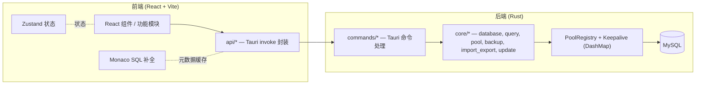

<div align="center">
  
</div>

<div align="center">

# Database Workbench

[简体中文(zh-CN)](README.md) / [English(en-US)](README.en.md)

</div>

<div align="center">

[](https://tauri.app)
[](https://react.dev)
[](https://www.typescriptlang.org)
[](https://www.rust-lang.org)
[](LICENSE)

</div>

一款现代、轻量的数据库管理桌面客户端，基于 **Tauri v2 + React + TypeScript** 构建。Database Workbench 提供直观的用户界面，用于连接数据库、编写与执行 SQL、设计表与视图、管理用户以及备份 / 恢复数据——全部封装在一个小巧、快速的原生应用中。

---

## 目录

  - [功能特性](#功能特性)
  - [技术栈](#技术栈)
  - [架构](#架构)
  - [项目结构](#项目结构)
  - [环境要求](#环境要求)
  - [快速开始](#快速开始)
  - [配置说明](#配置说明)
  - [开发指南](#开发指南)
  - [数据库支持与路线图](#数据库支持与路线图)
  - [贡献](#贡献)
  - [许可证](#许可证)
  - [相关链接](#相关链接)

---

## 功能特性

### 连接与查询

- **连接管理** — MySQL 连接配置，支持 SSL（`disabled` / `preferred` / `required` / `verify-ca` / `verify-identity`）、证书配置，以及连接配置导入 / 导出。
- **SQL 编辑器** — 基于 Monaco Editor，支持语法高亮、上下文感知的自动补全（由实时元数据缓存驱动）、SQL 格式化，以及多结果集执行。
- **脚本执行** — 具备 DELIMITER 感知的 SQL 脚本切分，使 `CREATE PROCEDURE / FUNCTION / TRIGGER` 等复合块可在同一物理连接上正确执行。

### 对象设计

- **表设计器** — 可视化设计表结构，支持字段、索引、外键、检查约束与触发器，并生成 `CREATE` / `ALTER` SQL。
- **视图设计器** — 创建与编辑视图，支持可更新视图的数据编辑。
- **函数 / 存储过程** — 创建、编辑与执行函数 / 存储过程。

### 数据与管理

- **表数据浏览** — 浏览、编辑、新增、删除行，支持服务端分页与 CSV 导出。
- **用户管理** — 创建用户、管理服务器级与数据库级权限，并生成相应 SQL。
- **备份** — 应用内原生导出（无需外部 `mysqldump`），支持对象级选择（表 / 视图 / 例程）与高级选项（结构/数据分离、触发器、gzip、批量 `INSERT`、事务）。
- **恢复** — 应用内原生恢复 `.sql` 与 `.sql.gz`，支持事务执行与遇错继续。
- **定时备份** — 基于 `cron` 的备份调度，在应用内管理。
- **导入 / 导出** — 支持 CSV、JSON、JSONL、Excel（`.xlsx`）、SQL、XML、HTML、TXT 格式的数据交换。

### 效率工具

- **收藏夹** — 收藏 SQL 查询、连接配置与数据库对象。
- **通知中心** — 记录操作历史，支持未读提示与一键清空。
- **执行日志 Dock** — 实时展示后端推送的 SQL 执行事件，支持筛选与分页。
- **软件更新** — GitHub 优先、国内镜像轮询、SHA-256 校验，并显示下载进度。
- **国际化** — 支持简体中文（`zh-CN`）与英文（`en-US`）。
- **主题切换** — 支持浅色 / 深色主题。
- **快捷键** — 丰富的键盘快捷键支持（见应用内快捷键对话框）。

---

## 技术栈

| 层级 | 技术 |
| ---- | ---- |
| 框架 | [Tauri](https://tauri.app) v2 |
| 前端 | React 18 + TypeScript 5，由 [Vite](https://vitejs.dev) 7 打包 |
| UI 组件库 | [Blueprint.js](https://blueprintjs.com) v6（`@blueprintjs/core`、`@blueprintjs/icons`） |
| 编辑器 | [Monaco Editor](https://microsoft.github.io/monaco-editor/)（`@monaco-editor/react`） |
| 样式 | Tailwind CSS 3 + `tailwind-merge` / `clsx` |
| 状态管理 | [Zustand](https://github.com/pmndrs/zustand) 5 |
| 表格 | [`@tanstack/react-table`](https://tanstack.com/table) v8 |
| 国际化 | [i18next](https://www.i18next.com) + `react-i18next` + 浏览器语言探测 |
| 图标 | [lucide-react](https://lucide.dev) |
| 后端 | Rust（edition 2021） |
| 数据库驱动 | [`sqlx`](https://github.com/launchbadge/sqlx) 原生 MySQL 驱动（+ `mysql` crate） |
| 连接池 | 基于 `sqlx` 原生连接池，由 `DashMap` 连接注册表管理，并带后台保活 |
| SQL 解析 | [`sqlparser`](https://github.com/apache/datafusion-sqlparser-rs)（语句切分） |
| 办公文档 | `calamine`（读 Excel）/ `rust_xlsxwriter`（写 Excel）、`csv`、`chrono`、`flate2`（gzip） |
| 运行时 | Tokio（多线程）、`cron`（调度）、`reqwest` + `rustls`（更新 / 地理） |
| 插件 | Tauri 插件：`dialog`、`fs`、`opener`、`process`、`shell`、`updater` |

---

## 架构

Database Workbench 遵循标准的 Tauri v2 分层：**React/TypeScript 前端**仅通过 Tauri 的 IPC（`invoke`）与 **Rust 后端**通信。后端负责全部数据库 I/O 并暴露类型化命令；前端从不直接连接数据库。



### 前端

- `features/` — 自包含的功能模块（connection、query、metadata-tree、data-browser、designer、backup、user-management、options、favorites、updater、dialogs、welcome）。
- `api/` — 对 Tauri `invoke` 的轻量封装，是项目中唯一感知 IPC 边界的地方。
- `components/` — 共享布局、图标及跨切面 UI（通知中心、执行日志 Dock）。
- `completion/` — 由后端元数据驱动的 Monaco SQL 自动补全提供器。
- `stores/` — Zustand 状态。`i18n/` — 本地化资源。`lib/`、`hooks/`、`types/` — 工具、共享 Hook 与类型。

### 后端（Rust）

- `commands/` — 按领域划分的命令处理模块，在 `lib.rs` 中注册（`invoke_handler`）。约 80 个命令，覆盖 pool、query、script、metadata、user、config、backup、import/export、favorites、sql utils、app、updater。
- `core/` — 业务逻辑：
  - `database/` — 实现统一 `DatabaseAdapter` trait 的引擎适配器。`mysql` 已启用；`postgresql` 与 `sqlite` 模块为进行中状态。
  - `pool/` — 连接池注册表（`DashMap`）与保活管理器。
  - `query/` — 查询执行、具备 DELIMITER 感知的脚本切分器，以及按编辑器隔离的 SQL 切分会话。
  - `metadata/` — 模式 introspection（表、视图、例程、列、外键、索引、触发器、检查约束、DDL）。
  - `backup_restore/` — 原生导出 / 恢复，以及基于 `cron` 的调度器。
  - `import_export/` — CSV / JSON / JSONL / XLSX / SQL / XML / HTML / TXT 的读写。
  - `update/` — GitHub 优先 + 镜像轮询更新器（网络探测、检查器、下载器）。
  - `user/` — 用户与权限管理。
- `models/` — 跨命令共享的 Serde DTO。`services/` — 应用配置缓存、收藏夹存储、会话日志、遗留数据迁移。`utils/` — SQL/JSON/文件/错误辅助函数。

---

## 项目结构

```
database-workbench/
├── src/                      # 前端 (React + TypeScript + Vite)
│   ├── api/                  # Tauri invoke 封装
│   ├── assets/               # Logo 与数据库图标
│   ├── components/           # 共享 UI（布局、图标、通知中心、日志 Dock）
│   ├── completion/           # Monaco SQL 自动补全提供器
│   ├── features/             # 功能模块（connection、query、metadata-tree、
│   │                         #   data-browser、designer、backup、user-management、
│   │                         #   options、favorites、updater、dialogs、welcome）
│   ├── hooks/                # 可复用 React Hook
│   ├── i18n/                 # i18next 配置 + 本地化（zh-CN、en-US）
│   ├── lib/                  # 工具函数（cn、sql、monaco、编辑器设置、格式化）
│   ├── stores/               # Zustand 状态
│   ├── styles/               # 全局样式 + 浅色/深色主题
│   ├── types/                # 共享 TypeScript 类型
│   ├── App.tsx
│   └── main.tsx
├── src-tauri/                # 后端 (Rust)
│   ├── src/
│   │   ├── commands/         # Tauri 命令处理
│   │   ├── core/             # 业务逻辑（见架构）
│   │   ├── models/           # Serde DTO
│   │   ├── services/         # 配置、收藏夹、会话日志、迁移
│   │   ├── utils/            # SQL/JSON/文件/错误辅助
│   │   ├── errors.rs
│   │   ├── lib.rs            # 入口：插件与命令注册
│   │   └── main.rs
│   ├── icons/
│   ├── capabilities/         # Tauri 权限配置
│   ├── Cargo.toml
│   └── tauri.conf.json
├── public/
├── package.json
├── vite.config.ts
├── tsconfig.json
└── tailwind.config.ts
```

---

## 环境要求

| 工具 | 版本 |
| ---- | ---- |
| Node.js | ≥ 20.19（推荐 ≥ 22.12，Vite 7 要求） |
| Rust | stable 工具链（edition 2021） |
| 平台 | Windows 10 / 11（x64）—— 主要支持的构建目标 |
| 运行时 | Microsoft Edge WebView2（Windows 11 预装；Windows 10 需安装） |
| 数据库 | 可访问的 MySQL 5.7+ 或 8.0+ 服务 |

> 构建 Rust 端还需 Windows 版的 Tauri v2 前置依赖（Visual Studio / Build Tools 的 **C++ 生成工具** 工作负载，以及 Windows SDK）。

---

## 快速开始

### 从 Release 下载

前往 [Releases](https://github.com/T-152-kw/database-workbench/releases) 页面下载最新安装包。

### 从源码构建

```bash
# 克隆仓库
git clone https://github.com/T-152-kw/database-workbench.git
cd database-workbench

# 安装前端依赖
npm install

# 开发模式运行（启动 Vite + Tauri 窗口）
npm run tauri dev

# 构建生产安装包 / 分发包
npm run tauri build
```

开发服务器运行于 `http://localhost:1420`（固定端口，Tauri 要求）。

---

## 配置说明

### 连接参数

MySQL 连接支持以下参数：

- 主机与端口
- 用户名 / 密码
- 默认数据库
- 字符集与排序规则
- 连接 / 空闲超时
- SSL 模式（`disabled` / `preferred` / `required` / `verify-ca` / `verify-identity`）
- SSL CA / 证书 / 密钥文件路径

### 应用设置

在 **工具 → 选项** 中可配置：

- 语言（简体中文 / English）
- 主题（浅色 / 深色）
- 启动行为
- 编辑器设置（字体大小、Tab 大小、自动换行等）
- 界面（侧边栏、状态栏）

---

## 开发指南

### 常用脚本

| 命令 | 说明 |
| ---- | ---- |
| `npm run dev` | 启动 Vite 开发服务器 |
| `npm run build` | 类型检查并构建前端（`tsc && vite build`） |
| `npm run preview` | 预览构建产物 |
| `npm run tauri dev` | 开发模式运行完整应用 |
| `npm run tauri build` | 构建可分发包 |
| `npm run typecheck` | 运行 `tsc --noEmit` |
| `npm run lint` | 使用 ESLint 检查 `src`（不允许任何警告） |
| `npm run lint:fix` | 自动修复 lint 问题 |
| `npm run knip` | 检测未使用的依赖 / 导出 |

### 代码布局说明

- **路径别名：** `@/*` 映射到 `src/*`（在 `vite.config.ts` 与 `tsconfig.json` 中配置）。
- **状态：** 全局 UI 状态位于 `src/stores` 下的 Zustand 存储；功能级逻辑就近放在 `src/features/*` 内。
- **IPC 边界：** 所有后端调用均经由 `src/api/*`。新增后端能力需：（1）实现 `commands::*` 处理器，（2）在 `src-tauri/src/lib.rs` 注册，（3）在 `src/api/*` 暴露类型化封装。
- **目前尚未配置自动化测试**，验证以手动为主。

---

## 数据库支持与路线图

| 引擎 | 状态 |
| ---- | ---- |
| MySQL | ✅ 完整支持（主引擎） |
| PostgreSQL | 🚧 适配器模块已存在，尚未接入连接池 |
| SQLite | 🚧 适配器模块已存在，尚未接入连接池 |
| SQL Server | 🔜 已在 `DbType` 类型系统中预留，未实现 |
| Oracle | 🔜 已在 `DbType` 类型系统中预留，未实现 |

多引擎设计已经就位（统一的 `DatabaseAdapter` trait 加各引擎模块），因此 PostgreSQL 与 SQLite 的支持主要是完善并启用其适配器。

---

## 贡献

欢迎贡献！请提交 [Issue](https://github.com/KevinT-hub/database-workbench/issues) 或 Pull Request。

- 反馈缺陷与功能需求时，请附上复现步骤 / 上下文。
- 保持 PR 聚焦；提交前请运行 `npm run typecheck` 与 `npm run lint`。
- 请遵循现有模块结构（前端功能放在 `src/features`，后端命令放在 `src-tauri/src/commands`）。

---

## 许可证

基于 **MIT 许可证** 开源，详见 [LICENSE](LICENSE)。

---

## 相关链接

- GitHub：[KevinT-hub/database-workbench](https://github.com/KevinT-hub/database-workbench)
